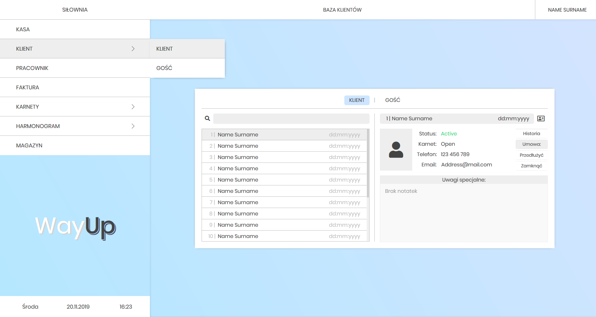
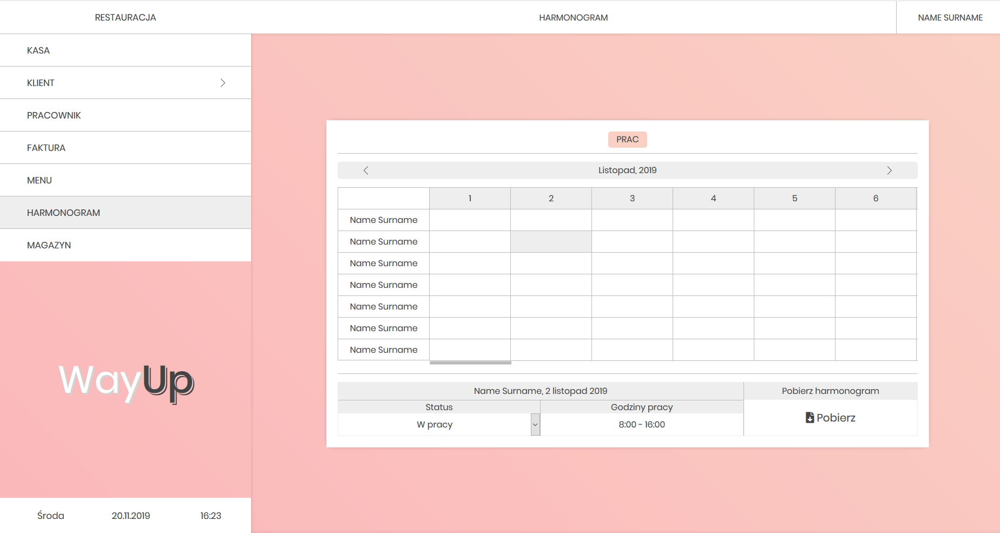

1. To run the system you need to have NodeJS platform on your PC - 
   you can download it from offcial website - https://nodejs.org/

2. The project consits of 2 parts: client and server 

   2.1.1 To launch the server you need to open 'server' folder path in console and run        	command 'npm install' - it will automatically download all required files 
   2.1.2 Then run command 'npm run dev' to launch database server

   2.2.1 To lauch the client you need to open 'client' folder path in console and run 	command 'npm install' - it will automatically download all required files    
   2.2.2 Then run command 'npm start electron:serve' to launch program

# Screenshots

